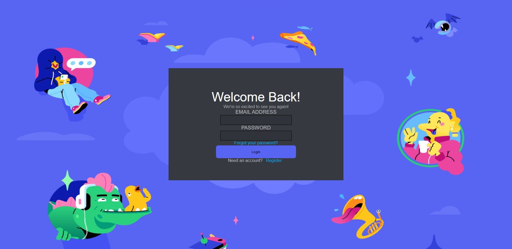
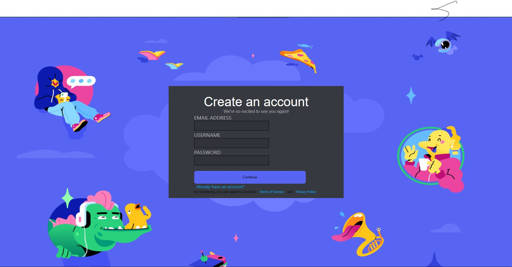
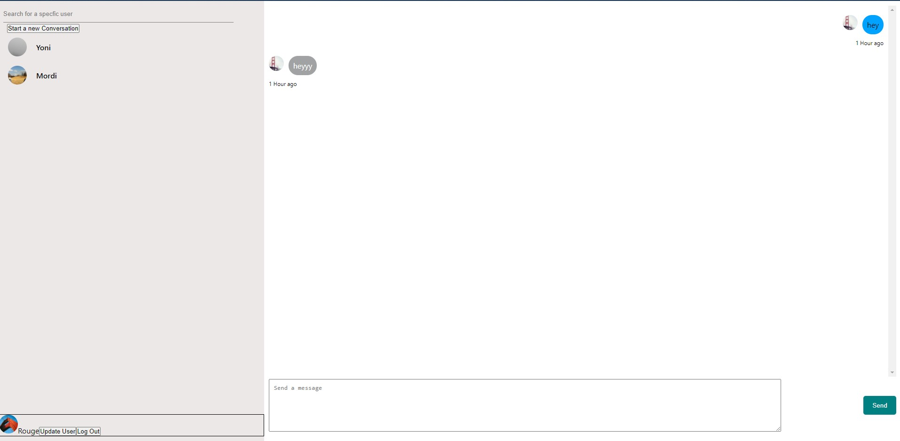

# Discord-MockApp
Appleseeds Final Project

### This Project was made by using:
1. ReactJS
2. NodeJS
3. MongoDB and Mongoose
4. socket.io

[Discord Mock Chatting App](https://discord-mock.herokuapp.com/)

# Features :

1. Fully working Login system with Authentication using JWT
2. Live Chatting App with WebSockets => Using Socket.io

 

# Current state of the Chatting App Project :
---------------------------------

-------------------------------------

------------------------------------

-------------------------------------

## Future Plans for this project:
1. Be able to create chat rooms  of more than two people
2. Add an option of voice calling and Video chatting
3. Create Servers with different channels to join and chat in
4. File Upload, be able to upload files -> In a chat and in a server
5. Update User Page

### CopyRight Claim

[Discord](https://discord.com/)

