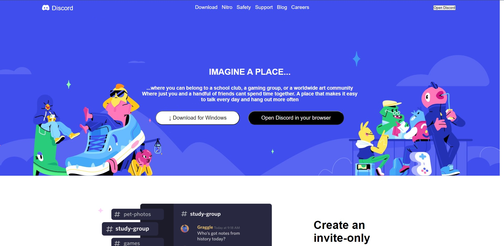

# Discord-MockApp
Appleseeds Final Project
---------------------
[Live Demo: Discord Mock Chatting App](https://discord-mock.herokuapp.com/)
------------------

### This Project was made by using:
1. ReactJS
2. NodeJS
3. MongoDB and Mongoose
4. Socket.io

# Reason why i picked this project:
Basically I went with this idea to mock the chatting app Discord is to learn about an amazing app that I use on a daily basis that helps me enjoy my time with my friends & I wanted to know how it is to build such an app, in addition it was a good opportunity to learn about Socket.io

# Features :

1. Fully working Login system with Authentication using JWT
2. Live Chatting App with WebSockets => Using Socket.io

 

# Current state of the Chatting App Project :
---------------------------------

-------------------------------------

------------------------------------

-------------------------------------

## Future Plans for this project:
1. Be able to create chat rooms  of more than two people
2. Send an Email on register
3. Add an option of voice calling and Video chatting
4. Create Servers with different channels to join and chat in
5. File Upload, be able to upload files -> In a chat and in a server
6. Update User Page

### CopyRight Claim

[Discord](https://discord.com/)

